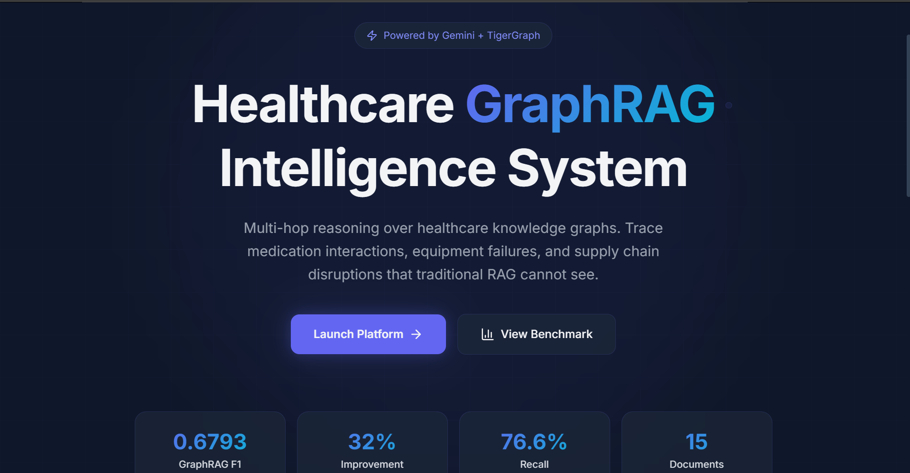
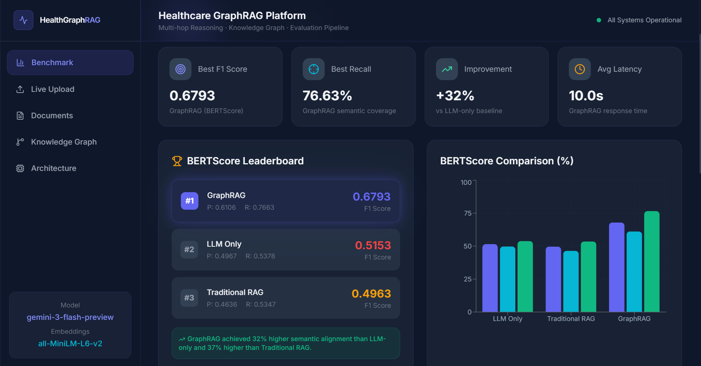
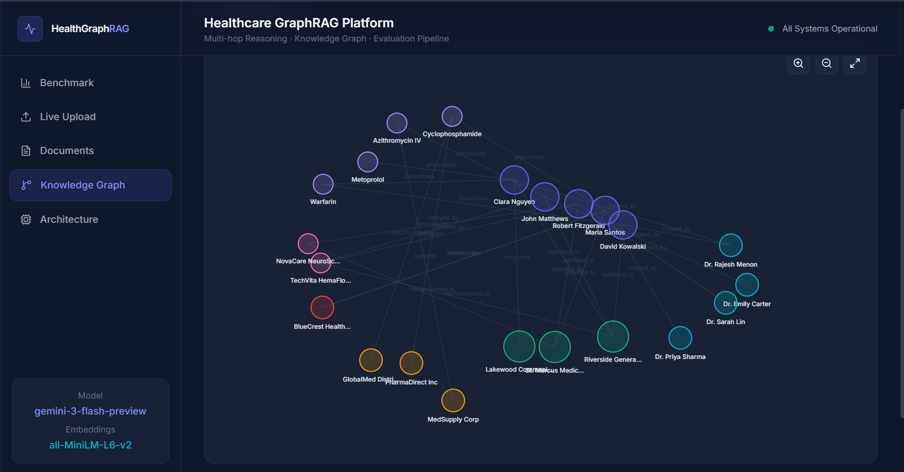
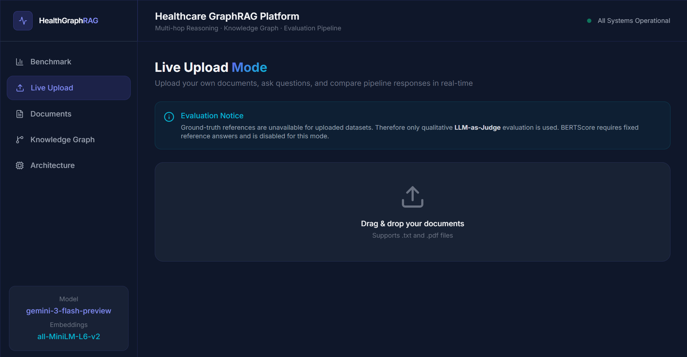

<div align="center">

# 🏥 MedGraphRAG

### Multi-Hop Healthcare Reasoning using GraphRAG

**A production-grade AI platform that demonstrates how Graph-Augmented Retrieval outperforms traditional approaches for complex, multi-hop healthcare reasoning tasks.**

[](https://python.org)
[](https://react.dev)
[](https://ai.google.dev)
[](https://www.tigergraph.com)
[](https://docker.com)

---

**GraphRAG achieves 32% higher semantic alignment than LLM-only and 37% higher than Traditional RAG**

</div>

---

## 📋 Table of Contents

- [Problem Statement](#-problem-statement)
- [Our Solution](#-our-solution)
- [System Architecture](#-system-architecture)
- [Features](#-features)
- [Benchmark Results](#-benchmark-results)
- [Dataset](#-dataset)
- [Tech Stack](#-tech-stack)
- [Quick Start](#-quick-start)
- [Project Structure](#-project-structure)
- [Screenshots](#-screenshots)
- [Future Scope](#-future-scope)

---

## 🎯 Problem Statement

Healthcare investigations require **multi-hop reasoning** — connecting information across patients, medications, equipment, suppliers, and insurance providers. Current approaches fail because:

| Challenge | LLM-Only | Traditional RAG | GraphRAG ✅ |
|-----------|----------|-----------------|-------------|
| Multi-hop entity chains | ❌ Hallucinated | ❌ Single-doc retrieval | ✅ Graph traversal |
| Cross-document reasoning | ❌ No access | ⚠️ Partial chunks | ✅ Full relationship mapping |
| Medication interaction tracing | ❌ Generic knowledge | ⚠️ Keyword match | ✅ Entity-relationship paths |
| Supply chain impact analysis | ❌ Fabricated data | ⚠️ Missing connections | ✅ Causal chain discovery |
| Clinical evidence grounding | ❌ Parametric only | ⚠️ Context window limits | ✅ Structured knowledge |

**Example:** *"Which patients were affected by the TechVita HemaFlow 9000 malfunction, and what treatment was delayed for each?"*
- **LLM-only:** "I have no information about this device." ❌
- **Traditional RAG:** "Lab results were delayed." (partial) ⚠️
- **GraphRAG:** "3 patients impacted: (1) John Matthews — sputum culture delayed 72h, (2) Clara Nguyen — CYP2C9 test delayed 48h, (3) Robert Fitzgerald — coagulation studies delayed." ✅

---

## 💡 Our Solution

**MedGraphRAG** combines three technologies to enable multi-hop healthcare reasoning:

```
📄 Documents → 🧬 Embeddings → 🕸️ Knowledge Graph → 🔍 Multi-Hop Retrieval → 🤖 Gemini LLM → 📊 Evaluation
```

1. **Knowledge Graph Construction** — Extracts entities (patients, doctors, hospitals, medications, devices, suppliers, insurance) and their relationships from 15 healthcare documents
2. **Graph-Augmented Retrieval** — Traverses entity relationships across multiple hops to find connected evidence
3. **LLM Synthesis** — Gemini `gemini-3-flash-preview` synthesizes graph context into evidence-grounded answers
4. **Rigorous Evaluation** — BERTScore + LLM-as-Judge provide quantitative and qualitative assessment

---

## 🏗️ System Architecture

```
┌─────────────┐     ┌──────────────┐     ┌──────────────────┐
│   React UI  │────▶│  FastAPI      │────▶│  GraphRAG        │
│  (Port 3001)│     │  Backend     │     │  (TigerGraph)    │
│             │     │  (Port 5000) │     │  (Port 8000)     │
└─────────────┘     └──────┬───────┘     └────────┬─────────┘
                           │                      │
                    ┌──────▼───────┐     ┌────────▼─────────┐
                    │  Gemini API  │     │  TigerGraph      │
                    │  (LLM)       │     │  Cloud           │
                    └──────────────┘     └──────────────────┘
                           │
                    ┌──────▼───────┐
                    │  Evaluation  │
                    │  Pipeline    │
                    │  BERTScore + │
                    │  LLM Judge   │
                    └──────────────┘
```

### Service Map

| Service | Port | Description |
|---------|------|-------------|
| **Frontend** | 3001 | React dashboard with benchmark visualization |
| **Backend** | 5000 | FastAPI REST API with RAG endpoints |
| **GraphRAG** | 8000 | TigerGraph GraphRAG inference service |
| **GraphRAG ECC** | 8001 | Entity component container |
| **Chat History** | 8002 | Conversation persistence |
| **Nginx** | 80 | Reverse proxy |

---

## ✨ Features

### 🔬 Benchmark Mode (Research)
- **7 multi-hop healthcare QA pairs** with ground truth
- **BERTScore evaluation** (Precision, Recall, F1) using `deberta-xlarge-mnli`
- **LLM-as-Judge** scoring with reasoning
- **Interactive leaderboard** with per-question drill-down
- **Radar, bar, and line charts** for multi-dimensional comparison

### 📤 Live Upload Mode
- **Drag & drop** TXT/PDF document upload
- **Real-time knowledge graph construction**
- **Side-by-side pipeline comparison** (LLM-only, Traditional RAG, GraphRAG)
- **LLM-as-Judge only** (BERTScore disabled — no ground truth)

### 🕸️ Knowledge Graph Explorer
- **Interactive graph visualization** with 22 nodes and 26 edges
- **Entity filtering** by type (patients, doctors, hospitals, medications, devices, suppliers, insurance)
- **Node selection** with connection highlighting
- **Zoom, pan, and drag** controls

### 📊 Analytics Dashboard
- Per-question F1 comparison
- Latency benchmarking
- Precision/Recall breakdown
- Pipeline architecture comparison

---

## 📈 Benchmark Results

Evaluated on 7 multi-hop healthcare questions using **BERTScore** (`microsoft/deberta-xlarge-mnli`, `rescale_with_baseline=False`):

| Rank | Pipeline | BERTScore F1 | Precision | Recall | Avg Latency |
|------|----------|-------------|-----------|--------|-------------|
| 🥇 | **GraphRAG** | **0.6793** | **0.6106** | **0.7663** | 10.0s |
| 🥈 | LLM Only | 0.5153 | 0.4967 | 0.5378 | 12.2s |
| 🥉 | Traditional RAG | 0.4963 | 0.4636 | 0.5347 | 8.6s |

### Key Findings

- 🏆 **GraphRAG achieves 32% higher semantic alignment** than LLM-only
- 📊 **37% improvement** over Traditional RAG
- 🔍 **76.6% recall** — captures multi-hop relationships traditional retrieval misses
- ⚡ **Zero OpenAI dependency** — fully powered by Gemini `gemini-3-flash-preview`

---

## 📁 Dataset

### Healthcare Corpus (15 documents)

| Category | Count | Examples |
|----------|-------|---------|
| Clinical Records | 7 | Patient histories, physician notes, pharmacy logs |
| Supply Chain | 3 | MedSupply Corp, PharmaDirect, GlobalMed delivery reports |
| Equipment | 2 | TechVita HemaFlow 9000, NovaCare NeuroScan 3T reports |
| Insurance | 1 | BlueCrest Health Insurance claim denial |
| Administrative | 2 | Hospital transfers, Lakewood Clinic HIE records |

### Entity Types

| Type | Count | Examples |
|------|-------|---------|
| Patients | 5 | Clara Nguyen, John Matthews, Robert Fitzgerald, Maria Santos, David Kowalski |
| Doctors | 4 | Dr. Rajesh Menon, Dr. Emily Carter, Dr. Sarah Lin, Dr. Priya Sharma |
| Hospitals | 3 | Riverside General, St. Marcus Medical Center, Lakewood Community Clinic |
| Medications | 4 | Warfarin, Metoprolol, Azithromycin IV, Cyclophosphamide |
| Suppliers | 3 | MedSupply Corp, PharmaDirect Inc, GlobalMed Distributors |
| Devices | 2 | TechVita HemaFlow 9000, NovaCare NeuroScan 3T |
| Insurance | 1 | BlueCrest Health Insurance |

---

## 🛠️ Tech Stack

### Frontend
| Technology | Version | Purpose |
|-----------|---------|---------|
| React | 19 | UI framework |
| Tailwind CSS | v4 | Utility-first styling |
| Framer Motion | 12 | Animations & transitions |
| Recharts | 3 | Data visualization |
| React Router | 7 | Client-side routing |

### Backend
| Technology | Version | Purpose |
|-----------|---------|---------|
| FastAPI | Latest | REST API server |
| Python | 3.11 | Runtime |
| Uvicorn | Latest | ASGI server |
| LangChain | Latest | RAG orchestration |
| FAISS | Latest | Vector similarity search |

### AI / ML
| Technology | Purpose |
|-----------|---------|
| Gemini `gemini-3-flash-preview` | LLM generation |
| `all-MiniLM-L6-v2` | Local embeddings (Traditional RAG) |
| `text-embedding-004` | GenAI embeddings (GraphRAG) |
| TigerGraph | Graph database & traversal |
| GraphRAG | Graph-augmented retrieval |

### Evaluation
| Technology | Purpose |
|-----------|---------|
| BERTScore (`deberta-xlarge-mnli`) | Semantic similarity |
| LLM-as-Judge (Gemini) | Qualitative scoring |
| Python evaluation scripts | Benchmark pipeline |

---

## 🚀 Quick Start

### Prerequisites
- Docker & Docker Compose
- Git

### Run

```bash
# Clone the repository
git clone https://github.com/yourusername/MedGraphRAG.git
cd MedGraphRAG

# Configure environment
cp backend/.env.example backend/.env
# Edit backend/.env with your GEMINI_API_KEY

# Launch all services
docker compose up --build
```

### Access

| Service | URL |
|---------|-----|
| **Frontend** | http://localhost:3001 |
| **Backend API** | http://localhost:5000 |
| **GraphRAG API** | http://localhost:8000 |
| **Full Platform** | http://localhost (via nginx) |

### Run Evaluation (without Docker)

```bash
# BERTScore evaluation
cd evaluation
pip install -r requirements.txt
python scripts/bertscore_eval.py

# LLM Judge
export GEMINI_API_KEY=your_key
python scripts/llm_judge.py

# Full benchmark
python scripts/benchmark.py
```

---

## 📂 Project Structure

```
MedGraphRAG/
├── docker-compose.yml          # Full-stack orchestration
├── nginx/
│   └── nginx.conf              # Reverse proxy config
│
├── frontend/                   # React 19 + Tailwind v4
│   ├── Dockerfile              # Multi-stage (Node → nginx:alpine)
│   ├── src/
│   │   ├── pages/              # Landing, Dashboard, Benchmark, LiveUpload,
│   │   │                       # Documents, GraphView, Architecture
│   │   ├── data/mockData.js    # Real benchmark data
│   │   └── services/api.js     # Axios API layer
│   └── package.json
│
├── backend/                    # FastAPI
│   ├── Dockerfile              # Python 3.11 slim
│   ├── app/
│   │   ├── main.py             # FastAPI entry
│   │   ├── api/routes/         # health, query, ingest, benchmark
│   │   └── services/           # RAG, LLM, vectorstore
│   └── requirements.txt
│
├── graphrag/                   # TigerGraph GraphRAG
│   ├── docker-compose.yml      # GraphRAG services (standalone)
│   ├── configs/
│   │   ├── server_config.json  # Gemini + GenAI config
│   │   └── db_config.json      # TigerGraph connection
│   ├── graphrag/               # Main RAG service
│   ├── ecc/                    # Entity component container
│   └── chat-history/           # Conversation persistence
│
└── evaluation/                 # Benchmark pipeline
    ├── scripts/
    │   ├── benchmark.py        # 3-pipeline benchmark runner
    │   ├── bertscore_eval.py   # BERTScore evaluation
    │   ├── llm_judge.py        # LLM-as-Judge scorer
    │   └── run_eval.py         # Master orchestrator
    ├── datasets/
    │   ├── ground_truth.json   # 7 multi-hop QA pairs
    │   └── synthetic_docs/     # 15 healthcare documents
    └── outputs/                # Results JSON + reports
```

---

## 📸 Screenshots

> *Screenshots of the live application*

### Landing Page

*Hero section with animated graph background, key stats, and pipeline comparison*

### Benchmark Dashboard

*BERTScore leaderboard, per-question F1 chart, radar comparison*

### Knowledge Graph Explorer

*Interactive visualization of 22 healthcare entities and 26 relationships*

### Live Upload Mode

<!--  -->

*Drag-drop documents, real-time pipeline comparison, LLM-as-Judge evaluation*

---

## 🔮 Future Scope

- **Real EHR Integration** — Connect to FHIR-compliant electronic health records
- **Clinical Decision Support** — Real-time alerts for medication interactions
- **Federated Healthcare Graphs** — Cross-institution knowledge graphs with privacy preservation
- **Medical Explainability Layer** — Visual reasoning paths showing exactly how GraphRAG reached its conclusion
- **Temporal Reasoning** — Track how clinical events evolve over time
- **Multi-language Support** — Support for non-English healthcare documentation

---

## 👥 Team

Built for **Hackathon 2025** — Healthcare AI Track

---

## 📄 License

This project is built for educational and demonstration purposes.

---

<div align="center">

**MedGraphRAG** — *Because healthcare reasoning demands more than keyword matching.*

</div>
